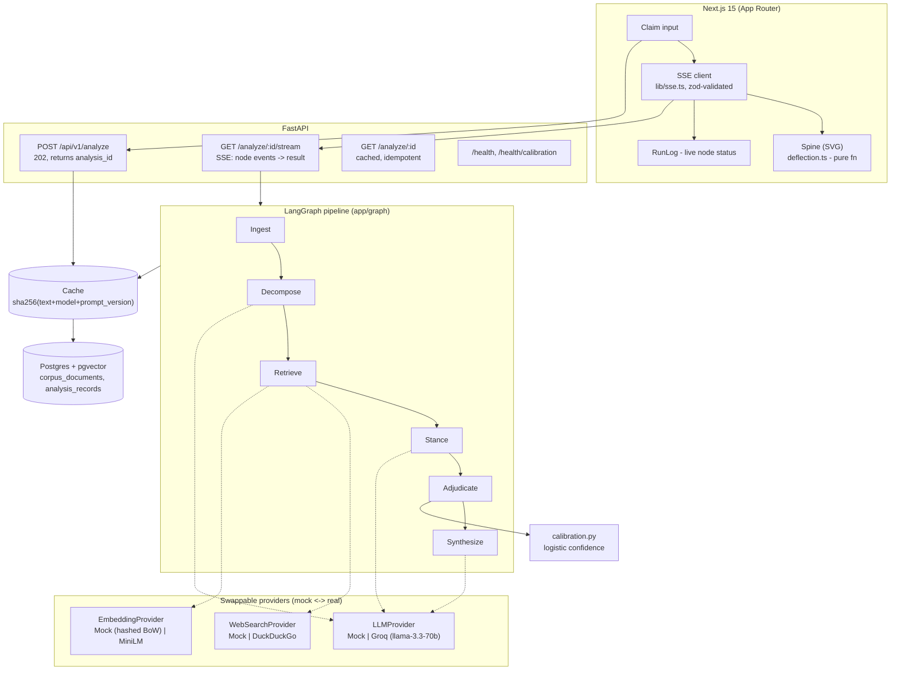

# VERITAS

A misinformation detection system whose product thesis is that **the reasoning is the output**. Paste a claim, a headline, or an article URL; VERITAS returns a calibrated verdict — `SUPPORTED | REFUTED | MISLEADING_CONTEXT | UNVERIFIABLE` — with every non-`UNVERIFIABLE` verdict traceable to a verbatim quoted span from a real source. A verdict with no evidence trail is treated as a bug, not a feature.

Never a binary real/fake label. `UNVERIFIABLE` is a first-class, non-embarrassing outcome returned whenever evidence is thin — not a failure mode to be hidden.

## 60-second quickstart (offline, no API key)

```bash
# Backend
cd backend
py -3.11 -m venv .venv
./.venv/Scripts/python.exe -m pip install -e ".[dev]"
./.venv/Scripts/python.exe -m uvicorn app.main:app --port 8000
# MOCK_MODE defaults to true - no Groq key, no Postgres, no network required

# Frontend (separate terminal)
cd frontend
npm install
echo "NEXT_PUBLIC_API_BASE_URL=http://localhost:8000" > .env.local
npm run dev
```

Open `http://localhost:3000`. Everything - claim decomposition, retrieval, stance classification, adjudication, synthesis - runs against deterministic mock providers. Same input, same output, every time, with zero network calls.

To run against real Groq + Postgres + pgvector, copy `.env.example` to `.env`, set `MOCK_MODE=false` and `GROQ_API_KEY`, then `docker compose up -d` before starting the backend.

## Architecture



Six-node LangGraph pipeline, strictly linear, every edge conditional on `state.error` (an error short-circuits straight to `END` instead of running further stages on broken state):

1. **`ingest`** — normalizes input, detects claim/headline/URL, extracts article text via `trafilatura` for URLs, rejects inputs under 15 tokens.
2. **`decompose`** — extracts 1-5 atomic claims, each typed `statistical | causal | attributive | event | opinion`. Opinion claims are kept and flagged, never silently dropped — `Claim.scored` is forced `false` for them by the model itself (`app/schemas/state.py`).
3. **`retrieve`** — fans out per scored claim to web search (+ pgvector corpus when wired to a live DB session), dedups by URL then by embedding cosine similarity, tags every hit with a `source_tier` via the static domain allowlist in `config_data/source_tiers.yaml`.
4. **`stance`** — classifies each (claim, evidence) pair as `SUPPORTS | REFUTES | NEUTRAL`. The anti-hallucination gate lives in code, not the prompt: `StanceResult.create()` forces the stance to `NEUTRAL` if no verbatim span is provided, full stop (`app/schemas/state.py`).
5. **`adjudicate`** — deterministic Python, no LLM call. Aggregates stances into a verdict via an explicit, unit-tested rule table (`app/graph/nodes/adjudicate.py`) — see below.
6. **`synthesize`** — one Groq call writes a 2-4 sentence explanation grounded only in retained spans. A post-check rejects any generated sentence containing a number or capitalized phrase absent from those spans, retries once, then falls back to a deterministic count-only template.

Every node is wrapped with per-node timeout and trace instrumentation (`app/graph/trace.py`); Groq calls get exponential backoff on 429s and a separate JSON-schema repair loop (max 2 retries) independent of that backoff (`app/providers/llm/groq_provider.py`).

## Adjudication rule table

Per `(claim, evidence)` pair: `weight = TIER_WEIGHT[source_tier] × stance_confidence`, where `TIER_WEIGHT = {1: 1.0, 2: 0.6, 3: 0.3}` — the tier gap is multiplicative, so two tier-3 sources can never outweigh one tier-1 source at equal confidence.

| # | Condition | Verdict | Reason code |
|---|---|---|---|
| 1 | claim type is `opinion` | *excluded, not scored* | `opinion_excluded` |
| 2 | no evidence retrieved | `UNVERIFIABLE` | `no_evidence` |
| 3 | all evidence is `NEUTRAL` | `UNVERIFIABLE` | `all_neutral` |
| 4 | two tier-1 sources disagree, both ≥0.5 confidence | `MISLEADING_CONTEXT` | `tier1_contradiction` — never a coin flip |
| 5 | evidence on both sides, agreement ratio < 0.65 | `MISLEADING_CONTEXT` | `mixed_evidence` |
| 6 | total weighted evidence < 0.5 | `UNVERIFIABLE` | `insufficient_weight` |
| 7 | support outweighs refute, agreement ≥ 0.65 | `SUPPORTED` | `support_majority` |
| 8 | refute outweighs support, agreement ≥ 0.65 | `REFUTED` | `refute_majority` |

The overall `AnalysisResult.overall_verdict` rolls up per-claim verdicts by severity (`REFUTED > MISLEADING_CONTEXT > UNVERIFIABLE > SUPPORTED`) — one false or contested claim is not laundered by several supported ones. 26 unit tests cover this table plus the rollup in `backend/tests/unit/test_adjudicate.py`.

## Calibration

Confidence is never the LLM's self-reported percentage — LLMs are badly calibrated, and asking one "how confident are you, 0-100" is a bug, not a metric. Instead (`app/graph/nodes/calibration.py`):

```
confidence = sigmoid(
    1.1 · evidence_count_norm      # saturates past 8 sources
  + 1.6 · tier1_fraction           # how much of it is high-trust
  + 1.8 · agreement_ratio          # how one-sided the evidence is - weighted highest
  + 0.9 · mean_similarity          # weakest signal alone; on-topic evidence can still contradict
  − 2.4                            # bias, so thin evidence reads as low confidence by default
)
```

The interval half-width shrinks with evidence count (`0.28 / sqrt(n+1)`, floor `0.05`) — sparse evidence gets an honestly wide band instead of false precision. The UI never shows a bare percentage or a gauge; `<ConfidenceInterval />` always renders an interval plus an evidence count, e.g. `0.61–0.78 · 9 sources · 2 tier-1`.

`GET /health/calibration` reports a 5-bin reliability table (predicted confidence vs. empirical accuracy, plus expected calibration error) over `backend/tests/fixtures/labelled_claims.json` — 40 examples, explicitly marked `SYNTHETIC`, not yet real labelled data. The `/calibration` frontend page renders this as a bar chart (the only use of Recharts in the app) and links to a dialog explaining the formula above.

## Frontend: the Evidence Spine

A single vertical rule runs down the left of the result view; each claim is a node on it; evidence branches off as short, hoverable ties colored by stance and weighted in opacity by source tier. The picture is the data, not a decoration of it:

- **Deflection** (`components/spine/deflection.ts`) is a pure function of `(verdict, net_stance_weight, confidence)`: `SUPPORTED` and `UNVERIFIABLE` sit plumb; `REFUTED` deflects right, scaled by how one-sided the evidence is and how much the system trusts that read; `MISLEADING_CONTEXT` kinks out and back, its magnitude driven by confidence in the conflict itself (`net_stance_weight` is near zero there by construction). 12 unit tests pin every boundary case.
- **Tie geometry** (`components/spine/tie-geometry.ts`): length ∝ claim-evidence similarity, opacity ∝ source tier (1→100%, 2→62%, 3→34%), color = stance. Also pure, also tested.
- Both the deflection shape and the underlying `(net_stance_weight, confidence)` numbers come from the exact same adjudication aggregate the backend computed — the frontend never re-derives or approximates them.
- Design tokens (`app/globals.css`): Terminal (dark, default) and Lab (light) themes, JetBrains Mono for every number/claim/label, Inter reserved exclusively for the synthesized explanation paragraph. Theme choice persists via a cookie, never `localStorage`.
- `prefers-reduced-motion` is a first-class branch, not a `duration: 0` hack — ties render without drawing, the run log updates without shimmer. A hydration-safety note: `usePrefersReducedMotion` (`lib/use-prefers-reduced-motion.ts`) deliberately does *not* use framer-motion's built-in `useReducedMotion`, because that hook can resolve synchronously on the client's first paint while the server has no way to know the value — causing a real hydration mismatch that was caught and fixed during development (see `useSyncExternalStore` usage there and in `useIsMobile`).

## Testing

```bash
# Backend - 50 tests, zero network calls (pytest-socket blocks non-loopback connections)
cd backend && ./.venv/Scripts/python.exe -m pytest tests/

# Frontend - 28 tests, pure logic (deflection, tie geometry, spine layout)
cd frontend && npm test
```

`MOCK_MODE=true` is forced for the whole backend suite in `tests/conftest.py`. The identical-input-is-deterministic and full-offline-pipeline guarantees are asserted directly, not just claimed: `test_identical_input_is_deterministic`, `test_pipeline_runs_end_to_end_with_no_network`, and the API-level `test_repeat_submission_reuses_analysis_id_and_is_cache_hit` / `test_stored_result_accumulates_trace_from_every_node`.

## What this system cannot do (honestly)

- **Live corpus retrieval isn't wired into the running app yet.** `POST /api/v1/corpus/ingest` stores documents into pgvector, but the process-wide graph instance built at startup is never given a request-scoped DB session, so the `retrieve` node currently only fans out to web search, even outside `MOCK_MODE`. Flagged in code at `app/main.py`. Ingested corpus documents are inert until this is wired up.
- **The DuckDuckGo web provider is unofficial and fragile.** `ddgs` scrapes a UI DuckDuckGo doesn't support for automation; it can rate-limit or break without warning, with no paid fallback allowed by this project's constraints. `MockSearchProvider` is what tests and offline demos actually exercise.
- **Claim decomposition caps at 5 claims, kept in document order**, not ranked by salience - a 20-claim article gets its first 5 sentence-order claims checked, not necessarily its most checkable ones.
- **The stance classifier's anti-hallucination gate only proves the span is verbatim, not that the model's stance label is correct.** A model can quote a real sentence and still misjudge whether it supports or refutes the claim; the gate prevents fabricated evidence, not misclassification.
- **The calibration fixture set (40 examples) is synthetic**, hand-authored to be plausible, not drawn from real-world labelled claims. `expected_calibration_error` on `/health/calibration` reflects calibration against synthetic data, not a validated real-world guarantee.
- **The mock providers are heuristic stand-ins, not model simulators.** `MockLLMProvider`'s stance classification is lexical token-overlap plus a negation-word list; it exercises every contract (schemas, the anti-hallucination gate, determinism) faithfully, but its actual judgment quality has nothing to do with the real Groq model's.
- **No auth, no rate limiting, no multi-tenant isolation.** The in-memory `InMemoryAnalysisRepository` used by default is a single process-wide dict - fine for a demo, not for concurrent untrusted users.
- **Source tiering is a static ~30-domain allowlist** (`config_data/source_tiers.yaml`), not a reputation model - anything unlisted defaults to tier 3, including legitimate outlets that simply aren't on the list yet.

## Stack

FastAPI (async) · LangGraph · Groq (`llama-3.3-70b-versatile`, temperature 0.0) via `langchain-groq` · PostgreSQL 16 + pgvector (SQLAlchemy 2.0 async, Alembic) · `sentence-transformers/all-MiniLM-L6-v2` (CPU) · Next.js 15 (App Router) + TypeScript + Tailwind v4 + Framer Motion · shadcn/ui (Base UI primitives, restyled) · pytest/pytest-asyncio · Vitest.
